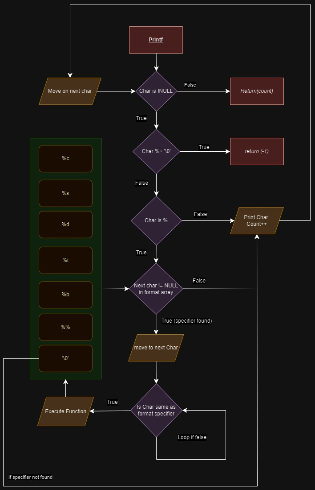
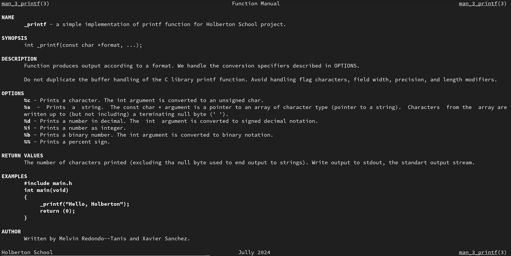

# holbertonschool-printf
This project is a group project for Holberton School that aims to reproduce the functionalities of the printf function from the standard C library. The function will be able to print characters, strings, integers, and binary numbers to the standard output stream.

## Requirements
**This requirements are imposed by Holberton School for this project.**
*   All files will be compiled on Ubuntu 20.04 LTS using `gcc` with the options `-Wall -Werror -Wextra -pedantic -std=gnu89`.
*   The code should follow the `Betty` style and will be checked using [betty-style.pl](https://github.com/hs-hq/Betty/blob/master/betty-style.pl) and [betty-doc.pl](https://github.com/hs-hq/Betty/blob/master/betty-doc.pl).
*   Global variables are not allowed.
*   Each file should have no more than 5 functions.

Authorized functions and macros:
*   `write`
*   `malloc`
*   `free`
*   `va_start`
*   `va_end`
*   `va_copy`
*   `va_arg`

## Flow Chart


## Usage
The function will be used this way:
```C
int _printf(const char *format, ...);
```
Where format is a string that contains the text to be written to the standard output stream. The function will return the number of characters printed (excluding the null byte at the end of the string) or -1 if an error occurs.

## Conversion Specifiers
The following conversion specifiers are handled by the function:
- %c: prints a character
- %s: prints a string
- %d: prints a decimal (base 10) number
- %i: prints an integer
- %b: prints a binary (base 2) number
- %%: prints a percent sign

## Compilation
Your code will be compiled this way:
```bash
gcc -Wall -Werror -Wextra -pedantic -std=gnu89 -Wno-format *.c
```

## Documentation
To access the documentation for the _printf function, run the following command:
```bash
man ./man_3_printf
```


## Authors
- [Melvin Redondo--Tanis]("https://melvin.redondotanis.com")
- [Xavier Sanchez]("https://www.linkedin.com/in/xavier-sanchez-b09b71311/")